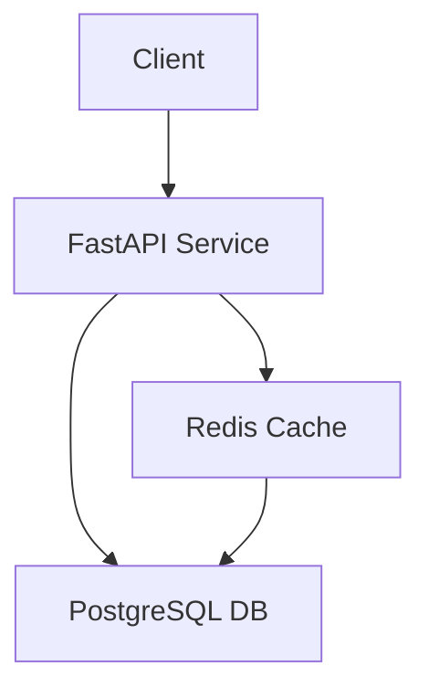

# Travel Recharge API - Architecture Document

## 🏗️ System Architecture

### Overview
The Travel Recharge API is a distributed system designed to handle travel card recharges and trip management. It follows a microservices architecture pattern with three main components:

1. **API Service (FastAPI)**
   - RESTful API endpoints
   - Business logic layer
   - Request validation and error handling
   - Redis caching integration

2. **Database Service (PostgreSQL)**
   - Data persistence
   - Complex queries and aggregations
   - ACID compliance
   - Stored procedures for performance

3. **Cache Service (Redis)**
   - In-memory caching
   - Performance optimization
   - Session management
   - Rate limiting (future)

### Network Topology


## 🔄 Data Flow

### Read Operations
1. Client requests data
2. API checks Redis cache
3. If cache miss:
   - Query PostgreSQL
   - Store in Redis
   - Return to client
4. If cache hit:
   - Return cached data
   - Update cache TTL

### Write Operations
1. Client sends write request
2. API validates request
3. Write to PostgreSQL
4. Invalidate affected cache keys
5. Return success response

## 💾 Caching Strategy

### What We Cache
- Aggregate data (totals, counts)
- Frequently accessed data
- Data that changes infrequently

### Cache Invalidation
- TTL-based expiration
- Write-through invalidation
- Selective key invalidation

### Cache Keys Pattern
```
{entity}:{id}:{attribute}
Example: trips:total, finance:revenue:by_localities
```

## 🔒 Security Considerations

### API Security
- Input validation
- Rate limiting (planned)
- CORS configuration
- Error handling

### Database Security
- Connection pooling
- Prepared statements
- Credential management
- Network isolation

### Cache Security
- Key prefixing
- TTL enforcement
- Memory limits
- Access control

## 📈 Performance Optimization

### Database
- Indexed queries
- Stored procedures
- Connection pooling
- Query optimization

### Caching
- Strategic cache placement
- TTL optimization
- Memory management
- Cache warming

### API
- Async endpoints
- Response compression
- Connection pooling
- Error handling

## 🔍 Monitoring and Observability

### Metrics
- Response times
- Cache hit/miss rates
- Error rates
- Resource usage

### Logging
- Request/response logging
- Error tracking
- Performance metrics
- Security events

### Health Checks
- Service health
- Database connectivity
- Cache availability
- API endpoints

## 🚀 Scalability Considerations

### Horizontal Scaling
- Stateless API design
- Database replication
- Cache clustering
- Load balancing

### Vertical Scaling
- Resource optimization
- Connection pooling
- Memory management
- Query optimization

## 🔄 Future Improvements

### Planned Features
1. Rate limiting
2. API authentication
3. Metrics collection
4. Automated testing
5. CI/CD pipeline

### Potential Optimizations
1. Cache warming strategies
2. Database sharding
3. Read replicas
4. Message queues
5. Circuit breakers

## 🛠️ Technology Stack

### Core Technologies
- FastAPI (Python)
- PostgreSQL
- Redis
- Docker

### Development Tools
- Git
- Docker Compose
- Python virtual environments
- Testing frameworks

### Monitoring Tools
- Docker stats
- Custom latency tests
- Health checks
- Logging

## 📚 References

- [FastAPI Documentation](https://fastapi.tiangolo.com/)
- [PostgreSQL Documentation](https://www.postgresql.org/docs/)
- [Redis Documentation](https://redis.io/documentation)
- [Docker Documentation](https://docs.docker.com/) 