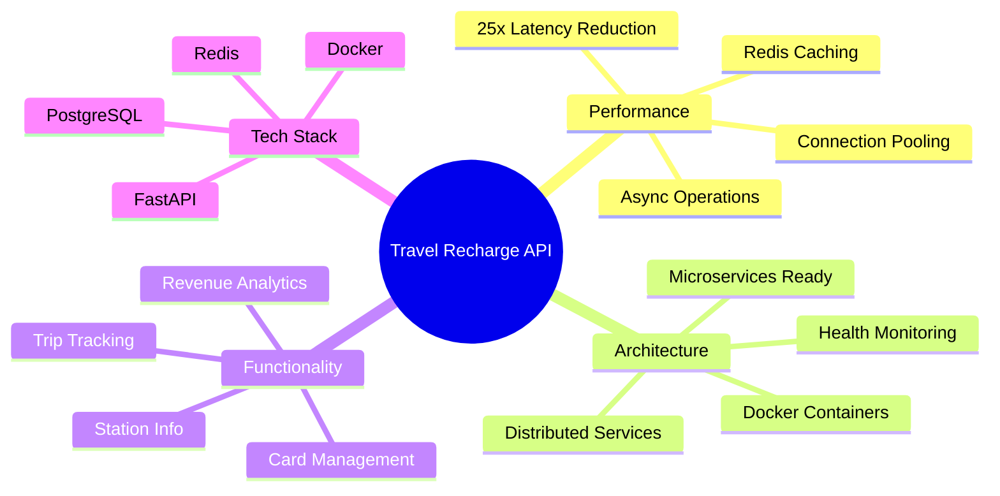
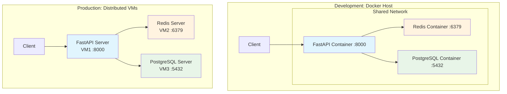
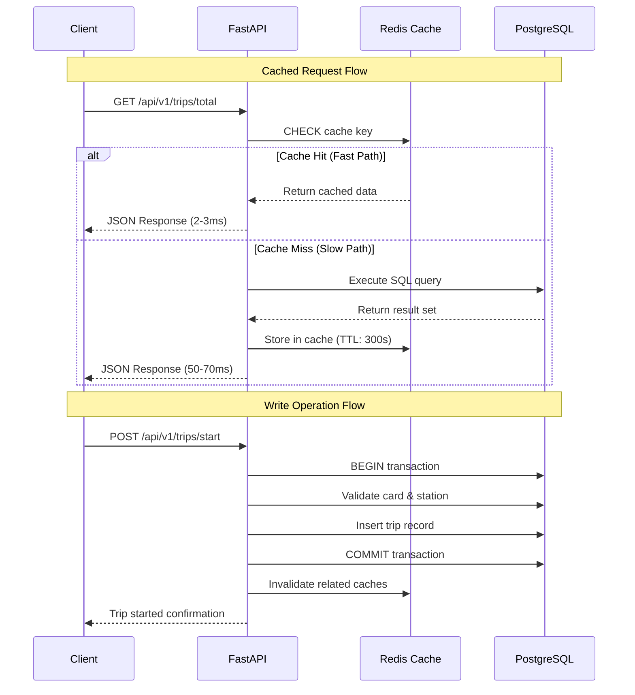
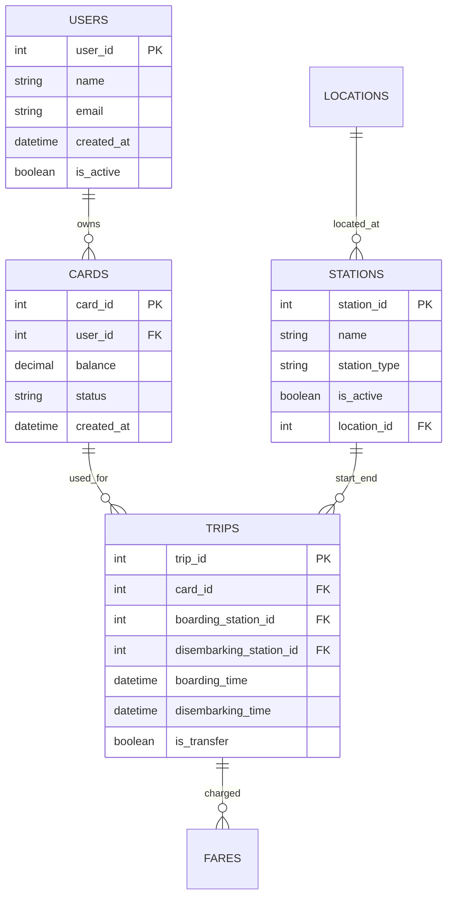
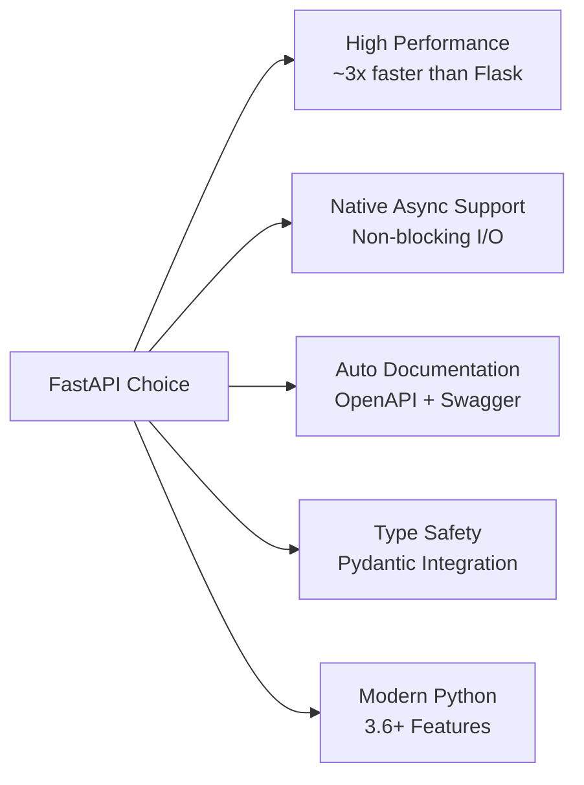

# Travel Recharge API – Distributed Systems Lab

[](https://www.python.org/downloads/)
[](https://fastapi.tiangolo.com/)
[](https://www.postgresql.org/)
[](https://redis.io/)
[](https://www.docker.com/)
[](LICENSE)

A high-performance, distributed API system simulating Bogotá's Integrated Public Transportation System (SITP/TransMilenio) card recharge and trip tracking services. Built with FastAPI, PostgreSQL, and Redis, this project demonstrates practical implementation of distributed systems concepts, caching strategies, and database optimization techniques.

> **Note:** This project uses a separate repository for the database schema and initialization scripts. You can find it at [travel-recharge-database](https://github.com/FreddyB200/travel-recharge-database).

## 📋 Table of Contents

- [🎯 Project Overview](#-project-overview)
- [🏗️ System Architecture](#️-system-architecture)
- [📊 Performance Metrics](#-performance-metrics)
- [🚀 Getting Started](#-getting-started)
- [📚 API Documentation](#-api-documentation)
- [🧪 Testing](#-testing)
- [📈 Monitoring](#-monitoring)
- [💡 Technical Decisions](#-technical-decisions)
- [📖 Documentation](#-documentation)
- [📝 License](#-license)

## 🎯 Project Overview

### Key Features


### Core Objectives
- **High Performance**: Sub-5ms response times on cached endpoints
- **Scalability**: Distributed architecture ready for microservices
- **Reliability**: Comprehensive error handling and monitoring
- **Real-world Simulation**: Based on Bogotá's public transportation system

### Technology Stack
| Component | Technology | Purpose |
|-----------|------------|---------|
| **API Framework** | FastAPI | High-performance async web framework |
| **Database** | PostgreSQL | ACID-compliant relational database |
| **Cache** | Redis | In-memory caching for performance |
| **Containerization** | Docker | Consistent deployment environments |
| **ORM** | SQLAlchemy | Database abstraction layer |
| **Validation** | Pydantic | Data validation and serialization |

## 🏗️ System Architecture

### Current Implementation (Single Service per VM)


### Data Flow Architecture


### Database Schema Overview


## 📊 Performance Metrics

### Latency Improvements with Redis
| Endpoint | Without Cache | With Cache | Improvement | Cache TTL |
|----------|--------------|------------|-------------|-----------|
| `/api/v1/trips/total` | 57.34ms | 3.2ms | **17.9x faster** | 300s |
| `/api/v1/finance/revenue` | 62.23ms | 2.55ms | **24.4x faster** | 300s |
| `/api/v1/users/active/count` | 9.11ms | 2.8ms | **3.25x faster** | 60s |

> **Note**: These are example metrics. Run `python scripts/latency_test.py` to get real measurements from your setup.

## 🚀 Getting Started

### Prerequisites Checklist
- [ ] Python 3.9+ installed
- [ ] Docker and Docker Compose installed
- [ ] Git installed
- [ ] 4GB+ RAM available
- [ ] Ports 8000, 5432, 6379 available

### Deployment Options

#### 🐳 Option A: Single Host with Docker (Current Implementation)
```bash
# 1. Clone repository
git clone https://github.com/FreddyB200/travel-recharge-api.git
cd travel-recharge-api

# 2. Setup environment and start services
cp docker.env.example docker.env
# Edit docker.env with your configuration
docker-compose up -d --build
```
**📖 [Complete Docker Setup Guide →](DOCKER_SETUP.md)**

#### 🌐 Option B: Distributed Deployment (Production Ready)
```bash
# Deploy each service on separate VMs
# PostgreSQL on VM1, Redis on VM2, FastAPI on VM3
```
**📖 [Complete Distributed Deployment Guide →](deployment.md)**

### Quick Verification
```bash
# Check if all services are running
curl http://localhost:8000/api/v1/health

# Test database connection
curl http://localhost:8000/api/v1/health/db

# Test Redis connection  
curl http://localhost:8000/api/v1/health/cache

# View API documentation
open http://localhost:8000/docs
```

## 📚 API Documentation

### Currently Implemented Endpoints

<details>
<summary><strong>👥 User Management</strong></summary>

| Method | Endpoint | Description | Status | Cached |
|--------|----------|-------------|--------|--------|
| `GET` | `/api/v1/users/count` | Get total user count | ✅ | ✅ (300s) |
| `GET` | `/api/v1/users/active/count` | Get active user count | ✅ | ✅ (60s) |
| `GET` | `/api/v1/users/latest` | Get latest registered user | ✅ | ✅ (120s) |

</details>

<details>
<summary><strong>💳 Card Management</strong></summary>

| Method | Endpoint | Description | Status | Cached |
|--------|----------|-------------|--------|--------|
| `POST` | `/api/v1/cards/recharge` | Recharge a travel card | ✅ | ❌ |
| `GET` | `/api/v1/cards/{card_id}/balance` | Check card balance | ✅ | ✅ (300s) |
| `GET` | `/api/v1/cards/{card_id}/history` | View recharge history | ✅ | ✅ (300s) |

</details>

<details>
<summary><strong>🚇 Trip Management</strong></summary>

| Method | Endpoint | Description | Status | Cached |
|--------|----------|-------------|--------|--------|
| `POST` | `/api/v1/trips/start` | Start a new trip | ✅ | ❌ |
| `POST` | `/api/v1/trips/end` | End a trip | 🚧 | ❌ |
| `GET` | `/api/v1/trips/total` | Get total trips statistics | ✅ | ✅ (300s) |
| `GET` | `/api/v1/trips/total/localities` | Get trips by locality | ✅ | ✅ (300s) |
| `GET` | `/api/v1/trips/card/{card_id}` | Get trips for specific card | ✅ | ✅ (300s) |

</details>

<details>
<summary><strong>🚉 Station Information</strong></summary>

| Method | Endpoint | Description | Status | Cached |
|--------|----------|-------------|--------|--------|
| `GET` | `/api/v1/stations` | List all stations | ✅ | ✅ (60s) |
| `GET` | `/api/v1/stations/{station_id}/arrivals` | Get real-time arrivals | ✅ | ✅ (60s) |
| `GET` | `/api/v1/stations/{station_id}/alerts` | Get station alerts | ✅ | ✅ (60s) |

</details>

<details>
<summary><strong>💰 Finance & Revenue</strong></summary>

| Method | Endpoint | Description | Status | Cached |
|--------|----------|-------------|--------|--------|
| `GET` | `/api/v1/finance/revenue` | Get total revenue | ✅ | ✅ (300s) |
| `GET` | `/api/v1/finance/revenue/localities` | Get revenue by locality | ✅ | ✅ (300s) |

</details>

<details>
<summary><strong>🗺️ Routes & Stations</strong></summary>

| Method | Endpoint | Description | Status | Cached |
|--------|----------|-------------|--------|--------|
| `GET` | `/api/v1/routes/codes` | Get all route codes | ✅ | ✅ (300s) |
| `GET` | `/api/v1/routes/{route_code}/details` | Get route details with stations | ✅ | ✅ (300s) |
| `GET` | `/api/v1/stations/identifiers` | Get all station identifiers | ✅ | ✅ (300s) |
| `GET` | `/api/v1/stations/{station_code}/details` | Get station details with routes | ✅ | ✅ (300s) |

</details>

<details>
<summary><strong>🚀 Cache Performance</strong></summary>

| Method | Endpoint | Description | Status | Cached |
|--------|----------|-------------|--------|--------|
| `GET` | `/api/v1/cache/stats` | Get Redis cache statistics | ✅ | ❌ |
| `GET` | `/api/v1/cache/keys` | Get information about cached keys | ✅ | ❌ |
| `GET` | `/api/v1/cache/health` | Check cache health and connectivity | ✅ | ❌ |
| `GET` | `/api/v1/cache/performance-test` | Run performance comparison test | ✅ | ❌ |
| `POST` | `/api/v1/cache/clear` | Clear all cache entries | ✅ | ❌ |
| `DELETE` | `/api/v1/cache/key/{key_name}` | Delete specific cache key | ✅ | ❌ |

</details>

<details>
<summary><strong>❤️ Health Checks</strong></summary>

| Method | Endpoint | Description | Status | Cached |
|--------|----------|-------------|--------|--------|
| `GET` | `/api/v1/health` | Overall system health | ✅ | ❌ |
| `GET` | `/api/v1/health/db` | Database connection status | ✅ | ❌ |
| `GET` | `/api/v1/health/cache` | Redis connection status | ✅ | ❌ |

</details>

**Legend**: ✅ Implemented | 🚧 In Progress | ❌ Not Started

### Interactive Documentation & Dashboards
- **Swagger UI**: http://localhost:8000/docs
- **ReDoc**: http://localhost:8000/redoc
- **OpenAPI Schema**: http://localhost:8000/openapi.json
- **Main Dashboard**: http://localhost:8000/dashboard
- **Routes Visualizer**: http://localhost:8000/routes
- **Cache Performance Monitor**: http://localhost:8000/cache

## 🧪 Testing

### Current Testing Implementation
```bash
# Install test dependencies
pip install -r requirements-test.txt

# Run all tests with coverage
pytest --cov=app tests/ --cov-report=html

# Run specific test categories
pytest tests/unit/test_users.py -v
pytest tests/unit/test_trips.py -v
pytest tests/unit/test_finance.py -v

# Performance testing (available)
python scripts/latency_test.py
python scripts/latency_non_cacheable.py
```

### Test Environment
- **Database**: SQLite in-memory (isolated per test)
- **Cache**: Mock Redis client (no external dependencies)
- **API Client**: FastAPI TestClient (fast integration testing)

### Load Testing with Locust
```bash
# Install Locust
pip install locust

# Run load tests (simulates thousands of concurrent users)
locust -f scripts/locustfile.py --host=http://localhost:8000

# Open web interface at http://localhost:8089
# Configure number of users and spawn rate
# Monitor real-time performance in dashboard
```

The Locust tests simulate realistic user behavior including:
- **Mobile App Users (55%)**: Frequent balance checks, route searches
- **Regular System Users (28%)**: Trip operations, recharges, system queries  
- **Data Analysts (11%)**: Statistical queries, revenue analysis
- **Admin Users (6%)**: Cache monitoring, performance testing

Real-time results are visible in the main dashboard showing:
- Response time improvements with Redis cache
- System performance under load
- Cache hit rates and effectiveness
- Distributed system latency across VMs

## 📈 Monitoring

### Current Monitoring Features
```bash
# Health check endpoints
curl http://localhost:8000/api/v1/health        # System status
curl http://localhost:8000/api/v1/health/db     # Database connectivity  
curl http://localhost:8000/api/v1/health/cache  # Redis connectivity

# Cache performance monitoring
curl http://localhost:8000/api/v1/cache/stats   # Redis statistics
curl http://localhost:8000/api/v1/cache/health  # Cache health check
```

### Web-Based Dashboards
- **📊 Main Dashboard** (`/dashboard`): Real-time system metrics, trip simulation controls
- **🗺️ Routes Visualizer** (`/routes`): Interactive route and station explorer
- **🚀 Cache Monitor** (`/cache`): Redis performance metrics and cache management

Key features:
- **Real-time metrics**: Live updates every 10 seconds
- **Performance testing**: Compare database vs cache response times
- **Cache management**: View, clear, and delete individual cache keys
- **Load simulation**: Built-in tools for generating test traffic

## 📋 Roadmap & TODO

### 🎯 Phase 1: Core Features (Current)
- [x] Basic API endpoints with FastAPI
- [x] PostgreSQL database integration
- [x] Redis caching layer
- [x] Docker containerization
- [x] Unit testing framework
- [x] Health check endpoints
- [x] Basic performance testing scripts

### 🚀 Phase 2: Enhanced Features (Next)
- [ ] **Monitoring Dashboard** (in progress)
  - [ ] Basic web interface showing system metrics
  - [ ] Real-time latency monitoring
  - [ ] Cache hit/miss rates visualization
  - [ ] Resource usage charts
- [ ] **Complete Trip Management**
  - [ ] Trip end functionality
  - [ ] Trip history detailed views
- [ ] **Enhanced Station Features**
  - [ ] Real-time arrival simulation
  - [ ] Alert management system
- [ ] **Load Testing Suite**
  - [ ] Apache Benchmark integration
  - [ ] Stress testing scripts
  - [ ] Performance regression testing

### 🏗️ Phase 3: Production Ready (Future)
- [ ] **High Availability Architecture**
  - [ ] Load balancer configuration
  - [ ] Multiple API server instances
  - [ ] Redis master/replica setup
  - [ ] PostgreSQL read replicas
- [ ] **Advanced Monitoring**
  - [ ] Prometheus metrics integration
  - [ ] Grafana dashboards
  - [ ] Log aggregation with ELK stack
  - [ ] Alerting system
- [ ] **Security & Performance**
  - [ ] API rate limiting
  - [ ] JWT authentication
  - [ ] Database query optimization
  - [ ] CDN integration
- [ ] **CI/CD Pipeline**
  - [ ] GitHub Actions workflows
  - [ ] Automated testing
  - [ ] Docker image building
  - [ ] Deployment automation

### 🎨 Phase 4: Standalone Dashboard (Vision)
- [ ] **React/Vue.js Frontend**
  - [ ] Real-time metrics dashboard
  - [ ] Interactive charts and graphs
  - [ ] System administration interface
  - [ ] Mobile-responsive design
- [ ] **Advanced Analytics**
  - [ ] Trip pattern analysis
  - [ ] Revenue forecasting
  - [ ] User behavior insights
  - [ ] Station performance analytics

## 💡 Technical Decisions

### Architecture Decisions Record (ADR)

#### Why FastAPI?


#### Why Redis for Caching?
- **Speed**: In-memory storage with microsecond latency
- **TTL Support**: Built-in expiration for cache invalidation
- **Data Types**: Rich data structures (strings, hashes, lists, sets)
- **Scalability**: Clustering and replication support
- **Atomic Operations**: Thread-safe operations

#### Why PostgreSQL?
- **ACID Compliance**: Reliable transactions
- **Complex Queries**: Advanced SQL features, JOINs, CTEs
- **JSON Support**: Native JSON/JSONB for flexible data
- **Performance**: Query optimization, indexing, partitioning
- **Ecosystem**: Rich tooling and extension ecosystem

### Performance Optimization Strategies

1. **Database Level**:
   - Connection pooling with SQLAlchemy
   - Optimized queries with proper indexing
   - Read replicas for scaling reads

2. **Application Level**:
   - Async/await for non-blocking operations
   - Request/response caching with Redis
   - Lazy loading of related data

3. **Infrastructure Level**:
   - Container orchestration for scaling
   - Load balancing across API instances
   - CDN for static content delivery

## 📖 Documentation

### Setup Guides
- [📦 Docker Setup Guide](DOCKER_SETUP.md) - Single-host development setup
- [🌐 Distributed Deployment Guide](deployment.md) - Multi-VM production deployment

### Additional Resources
- [🏗️ Architecture Deep Dive](ARCHITECTURE.md) - Detailed system architecture
- [🔧 API Reference](http://localhost:8000/docs) - Interactive API documentation
- [📊 Performance Guide](scripts/README.md) - Load testing and optimization

## 📝 License

This project is licensed under the MIT License - see the [LICENSE](LICENSE) file for details.

## 🙏 Acknowledgments

- **Frameworks & Libraries**:
  - [FastAPI](https://fastapi.tiangolo.com/) - Modern Python web framework
  - [SQLAlchemy](https://www.sqlalchemy.org/) - Python SQL toolkit
  - [Redis](https://redis.io/) - In-memory data structure store
  
- **Infrastructure**:
  - [Docker](https://www.docker.com/) - Containerization platform
  - [PostgreSQL](https://www.postgresql.org/) - Advanced open source database
