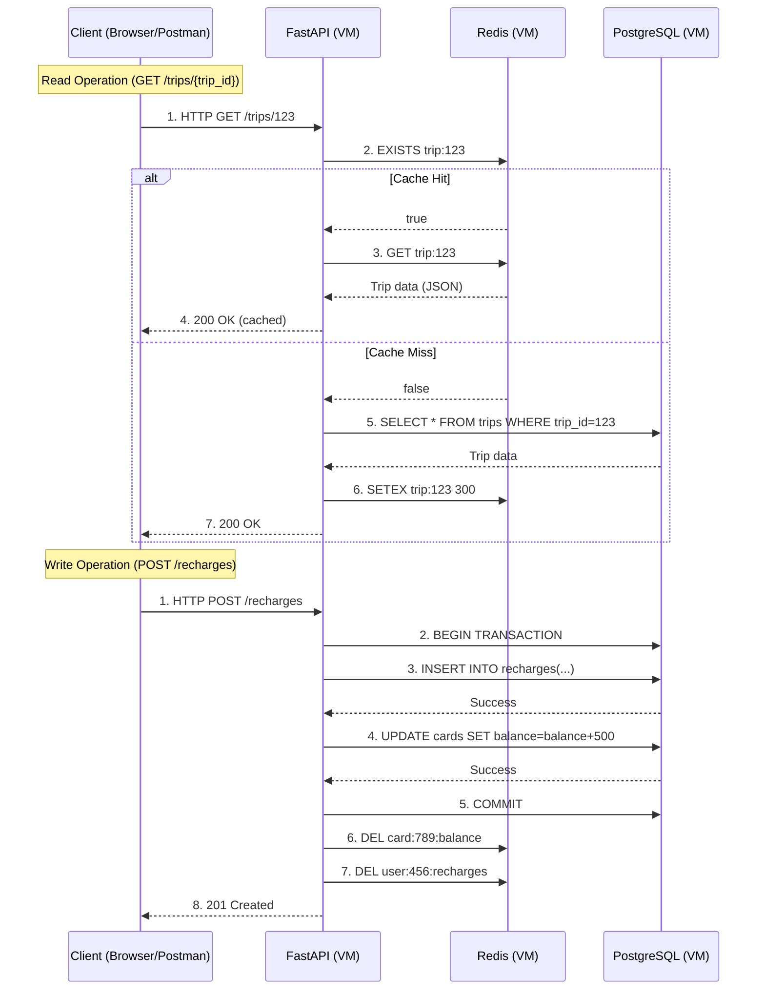

# Travel Recharge API – Distributed Systems Lab
This project simulates a recharge system (like TransMilenio cards) using a distributed architecture with FastAPI, PostgreSQL, and Redis. It demonstrates caching, database logic optimization, and API development using modern Python tools.

> **Goal**  
> Build, deploy and test a simple distributed architecture:
> - **FastAPI** REST API  
> - **PostgreSQL** relational database (Docker)  
> - **Redis** in-memory cache (Docker) 

---

## 📖 Table of Contents

1. [Context](#context)  
2. [Architecture](#architecture)  
   - [Network Topology](#network-topology)  
   - [Container Diagram](#container-diagram)  
3. [Prerequisites](#prerequisites)  
4. [Installation & Setup](#installation--setup)  
5. [Usage](#usage)  
6. [Deployment](#deployment)  
   - [`DEPLOYMENT.md`](#deploymentmd)  
   - `DEPLOYMENT-REDIS.md` (proposed)  
7. [Future Improvements](#future-improvements)  
8. [License](#license)  

---

## Context

Modern systems need low-latency, high-throughput data access.  
- **PostgreSQL** provides durability, consistency and complex queries.  
- **Redis** sits as a cache layer, speeding up repeated reads (e.g. stats, aggregates).  
- **FastAPI** ties it all together with async endpoints.

## Architecture
### Network Topology

### Container Diagram

---
### Request flow

---
## Project Structure
```bash
SISTEMA-RECARGA-VIAJES-BACKEND/
├── app/
│   ├── database.py       # Database connection and setup
│   ├── dependencies.py   # Dependency injection for database sessions
│   ├── main.py           # FastAPI application and endpoints
│   ├── models.py         # Database models (if used)
│   └── __pycache__/      # Compiled Python files
├── requirements.txt      # Python dependencies
├── .gitignore            # Git ignore rules
├── DEPLOYMENT.md         # Deployment guide
└── README.md             # Project documentation
```

---

## Getting Started

### Prerequisites
- VirtualBox VMs with Ubuntu/Alpine or any linux OS
- Docker & Docker Compose installed on each VM
- SSH keys configured for password-less login
- Git & GitHub account
- Python 3.8 or higher
- pip (Python package manager)

### Installation

For installation guide, refer to the [Deployment Guide](DEPLOYMENT.md).

---

## Documentation

- http://127.0.0.1:8000/docs
- http://127.0.0.1:8000/redoc

---

## Database Repository

The database for this project is managed in a separate repository. You can find it here:

[Database Repository](https://github.com/FreddyB200/travel-recharge-database.git)

---
## Latency Testing Results

### Cacheable Endpoints

#### Endpoint: `/trips/total`
- **First Request (Cache MISS)**: 57.34 ms
- **Second Request (Cache HIT)**: 3.2 ms
- **Third Request**: 6 ms

#### Endpoint: `/trips/finance/revenue`
- **First Request (Cache MISS, with postgres)**: 62.23 ms
- **Second Request (Cache HIT, with Redis)**: 2.55 ms

### Non-Cacheable Endpoints

#### Endpoint: `/users/count`
- **Average Latency**: 8.11 ms

#### Endpoint: `/users/active/count`
- **Average Latency**: 9.11 ms

#### Endpoint: `/users/latest`
- **Average Latency**: 6.69 ms

---

## Scripts Used for Latency Testing

### Cacheable Endpoints
The script `latency_test.py` was used to measure the latency for cacheable endpoints. It sends two requests to the endpoint and calculates the latency for Cache MISS and Cache HIT scenarios.

### Non-Cacheable Endpoints
The script `latency_non_cacheable.py` was used to measure the latency for non-cacheable endpoints. It sends multiple requests to the endpoints and calculates the average latency.

---

## How to Use the Latency Scripts

1. **Run the Cacheable Latency Script**:
   ```bash
   python latency_test.py
   ```
   This will measure the latency for cacheable endpoints.

2. **Run the Non-Cacheable Latency Script**:
   ```bash
   python latency_non_cacheable.py
   ```
   This will measure the latency for non-cacheable endpoints.

3. **Analyze Results**:
   Compare the results to understand the performance improvements provided by Redis caching.


## License
This project is licensed under the MIT License. See the LICENSE file for details.

---

## Acknowledgments
- [FastAPI Documentation](https://fastapi.tiangolo.com/)
- [SQLAlchemy Documentation](https://docs.sqlalchemy.org/)
- [Docker Documentation](https://docs.docker.com/)
- [Redis Documentation](https://redis.io/docs/latest/)

---