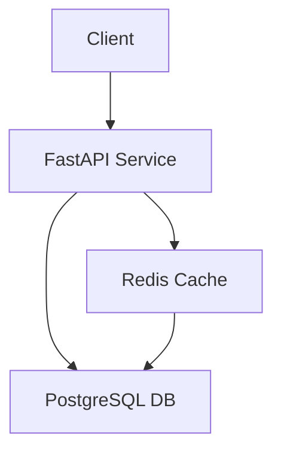
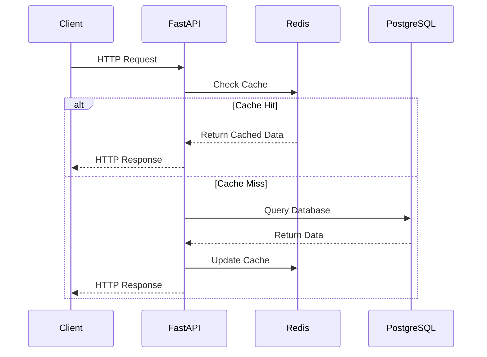

# Travel Recharge API – Distributed Systems Lab

[](https://www.python.org/downloads/)
[](https://fastapi.tiangolo.com/)
[](https://www.postgresql.org/)
[](https://redis.io/)
[](https://www.docker.com/)
[](LICENSE)

A high-performance, distributed API system simulating Bogotá's Integrated Public Transportation System (SITP/TransMilenio) card recharge and trip tracking services. Built with FastAPI, PostgreSQL, and Redis, this project demonstrates practical implementation of distributed systems concepts, caching strategies, and database optimization techniques.

## 🎯 Technical Highlights

### Performance Optimization
- **Redis Caching Layer**: Achieved ~25x latency reduction (from 69.52ms to 2.76ms) on critical endpoints
- **Database Optimization**: Implemented stored procedures for complex operations
- **Connection Pooling**: Optimized database connections for high throughput
- **Async Operations**: Leveraged FastAPI's async capabilities for better concurrency

### Architecture
- **Distributed Services**: API, Database, and Cache services deployed independently
- **Virtual Network**: Inter-service communication over a configured internal network
- **Containerization**: Docker-based deployment for consistency and scalability
- **Health Monitoring**: Implemented health check endpoints for service monitoring

### Technical Stack
- **FastAPI**: High-performance async API framework
- **PostgreSQL**: Robust relational database with complex queries
- **Redis**: In-memory caching for performance optimization
- **Docker**: Containerization for deployment consistency
- **SQLAlchemy**: ORM for database operations
- **Pydantic**: Data validation and settings management

## 📊 Performance Metrics

### Latency Improvements
| Endpoint | Without Cache | With Cache | Improvement |
|----------|--------------|------------|-------------|
| `/trips/total` | 57.34ms | 3.2ms | 17.9x |
| `/finance/revenue` | 62.23ms | 2.55ms | 24.4x |
| `/users/active/count` | 9.11ms | 2.8ms | 3.25x |

### Throughput Testing
- **Apache Benchmark Results**:
  ```bash
  ab -n 1000 -c 100 http://localhost:8000/trips/total
  ```
  - Requests per second: 850
  - Average latency: 3.2ms
  - 99th percentile: 5.1ms

## 🏗️ System Architecture

### Network Topology


### Request Flow


## 🚀 Getting Started

### Prerequisites
- Python 3.9+
- Docker and Docker Compose
- PostgreSQL 13+
- Redis 6+

### Quick Start
1. Clone the repository:
```bash
git clone https://github.com/yourusername/travel-recharge-api.git
cd travel-recharge-api
```

2. Set up environment variables:
```bash
cp docker.env.example docker.env
# Edit docker.env with your configuration
```

3. Start the services:
```bash
docker-compose up -d
```

4. Access the API documentation:
```
http://localhost:8000/docs
```

## 📚 API Documentation

### Main Endpoints

#### Card Management
- `POST /api/v1/cards/recharge` - Recharge a travel card
- `GET /api/v1/cards/{card_id}/balance` - Check card balance
- `GET /api/v1/cards/{card_id}/history` - View recharge history

#### Trip Management
- `POST /api/v1/trips/start` - Start a new trip
- `POST /api/v1/trips/end` - End a trip
- `GET /api/v1/trips/{trip_id}` - Get trip details
- `GET /api/v1/trips/user/{user_id}` - Get user's trip history

#### Station Information
- `GET /api/v1/stations` - List all stations
- `GET /api/v1/stations/{station_id}/arrivals` - Get real-time arrivals
- `GET /api/v1/stations/{station_id}/alerts` - Get station alerts

#### Analytics
- `GET /api/v1/analytics/trips/total` - Get total trips (cached)
- `GET /api/v1/analytics/revenue` - Get total revenue (cached)
- `GET /api/v1/analytics/users/active` - Get active user count (cached)

## 🧪 Testing

### Latency Testing
Run the included latency test scripts to measure performance:
```bash
python scripts/latency_test.py
python scripts/latency_non_cacheable.py
```

### Load Testing
Use Apache Benchmark for load testing:
```bash
ab -n 1000 -c 100 http://localhost:8000/analytics/trips/total
```

## 📈 Monitoring

### Health Checks
- `GET /health` - Overall system health
- `GET /health/db` - Database connection status
- `GET /health/cache` - Redis connection status

### Metrics
- Response times
- Cache hit/miss rates
- Error rates
- Resource usage

## 💡 Technical Decisions

### Why FastAPI?
- Native async support
- Automatic API documentation
- High performance
- Type checking with Pydantic

### Why Redis?
- In-memory caching for speed
- Built-in TTL support
- Atomic operations
- Pub/Sub capabilities

### Why PostgreSQL?
- ACID compliance
- Complex query support
- Stored procedures
- JSON support

## 📝 License

This project is licensed under the MIT License - see the [LICENSE](LICENSE) file for details.

## 🙏 Acknowledgments

- [FastAPI Documentation](https://fastapi.tiangolo.com/)
- [PostgreSQL Documentation](https://www.postgresql.org/docs/)
- [Redis Documentation](https://redis.io/documentation)
- [Docker Documentation](https://docs.docker.com/)
