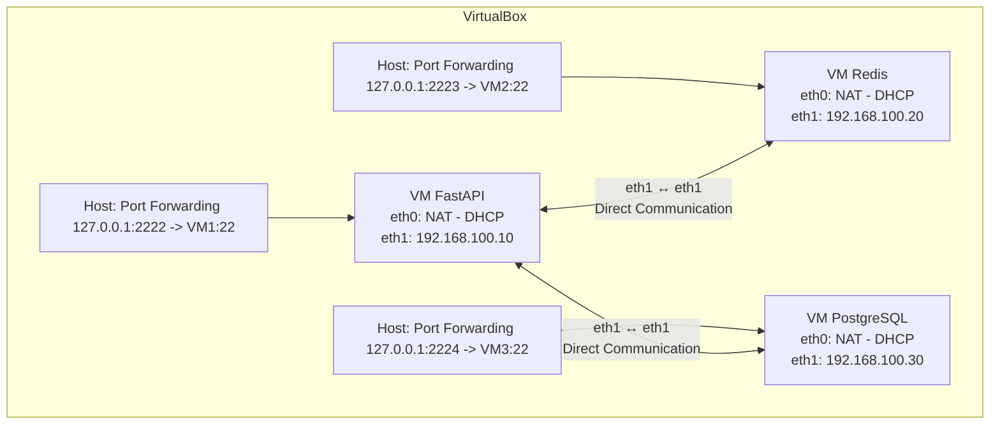

# Distributed Services Lab: FastAPI + PostgreSQL + Redis

> **Goal**  
> Build, deploy and test a simple distributed architecture:
> - **FastAPI** REST API  
> - **PostgreSQL** relational database (Docker)  
> - **Redis** in-memory cache (Docker) 

---

## 📖 Table of Contents

1. [Context](#context)  
2. [Architecture](#architecture)  
   - [Network Topology](#network-topology)  
   - [Container Diagram](#container-diagram)  
3. [Prerequisites](#prerequisites)  
4. [Installation & Setup](#installation--setup)  
5. [Usage](#usage)  
6. [Deployment](#deployment)  
   - [`DEPLOYMENT.md`](#deploymentmd)  
   - `DEPLOYMENT-REDIS.md` (proposed)  
7. [Future Improvements](#future-improvements)  
8. [License](#license)  

---

## Context

Modern systems need low-latency, high-throughput data access.  
- **PostgreSQL** provides durability, consistency and complex queries.  
- **Redis** sits as a cache layer, speeding up repeated reads (e.g. stats, aggregates).  
- **FastAPI** ties it all together with async endpoints.

## Architecture
### Network Topology

### Container Diagram

---

## Project Structure

```
SISTEMA-RECARGA-VIAJES-BACKEND/
├── app/
│   ├── database.py       # Database connection and setup
│   ├── dependencies.py   # Dependency injection for database sessions
│   ├── main.py           # FastAPI application and endpoints
│   ├── models.py         # Database models (if used)
│   └── __pycache__/      # Compiled Python files
├── requirements.txt      # Python dependencies
├── .gitignore            # Git ignore rules
├── DEPLOYMENT.md         # Deployment guide
└── README.md             # Project documentation
```

---

## Getting Started

### Prerequisites
- VirtualBox VMs with Ubuntu/Alpine or any linux OS
- Docker & Docker Compose installed on each VM
- SSH keys configured for password-less login
- Git & GitHub account
- Python 3.8 or higher
- pip (Python package manager)
- Git

### Installation
1. Clone the repository:
   ```bash
   git clone https://github.com/FreddyB200/sistema-recarga-viajes-backend.git
   cd SISTEMA-RECARGA-VIAJES-BACKEND
   ```

2. Set up the environment variables:
   ```bash
   cp .env.example .env
   ```
   Configure the `.env` file with your database credentials and other settings.

3. Create a virtual environment and install dependencies:
   ```bash
   python3 -m venv venv
   source venv/bin/activate
   pip install -r requirements.txt
   ```

4. Run the application:
   ```bash
   uvicorn app.main:app --host 0.0.0.0 --port 8000 --reload
   ```
   with FastAPI:
   ```bash
   fastapi dev app/main.py --host 0.0.0.0 --port 8000
   ```

5. Access the API documentation:
   - Swagger UI: [http://127.0.0.1:8000/docs](http://127.0.0.1:8000/docs)
   - ReDoc: [http://127.0.0.1:8000/redoc](http://127.0.0.1:8000/redoc)

---

## Database Repository

The database for this project is managed in a separate repository. You can find it here:

[Database Repository](https://github.com/FreddyB200/sistema-recargas-viajes-db.git)

---

---

## License

This project is licensed under the MIT License. See the LICENSE file for details.

---

## Acknowledgments

- [FastAPI Documentation](https://fastapi.tiangolo.com/)
- [SQLAlchemy Documentation](https://docs.sqlalchemy.org/)
- [Docker Documentation](https://docs.docker.com/)
