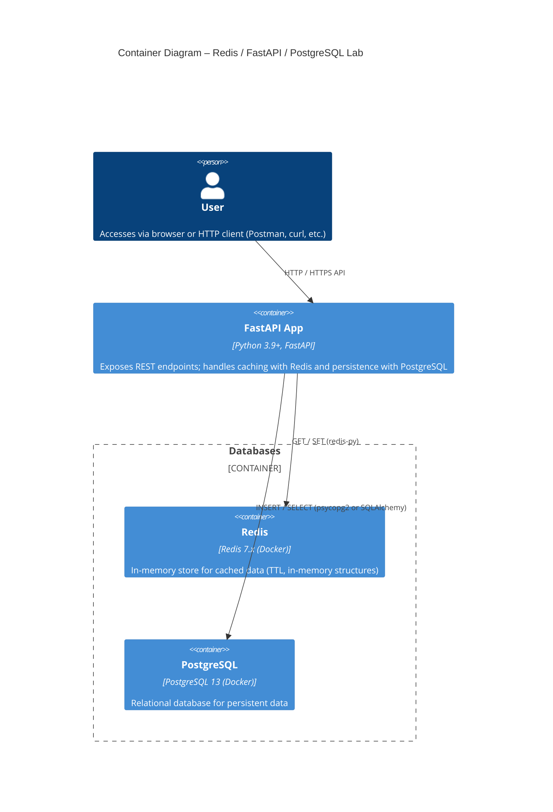
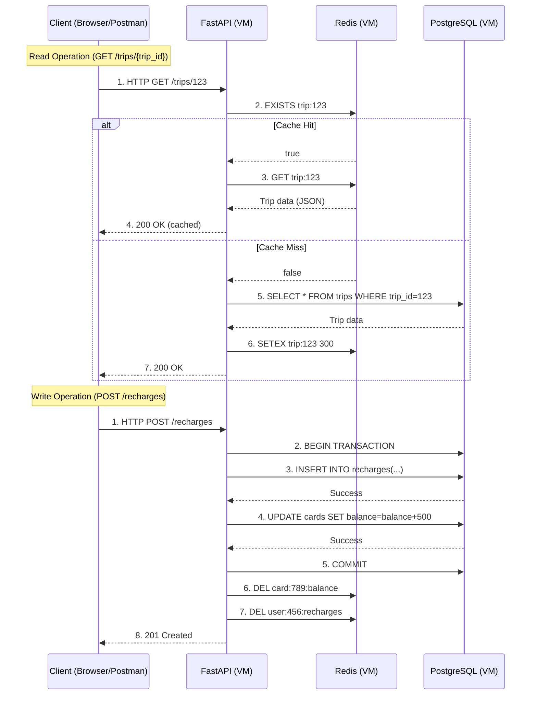

# Travel Recharge API – Distributed Systems Lab

This project simulates a recharge system (like TransMilenio cards) using a distributed architecture with FastAPI, PostgreSQL, and Redis. It demonstrates caching, database logic optimization, and API development using modern Python tools.

> **Project Goal:** Build, deploy, and test a simple distributed architecture featuring:
> * **FastAPI** REST API
> * **PostgreSQL** relational database (Dockerized, setup instructions and schema in its [own repository](https://github.com/FreddyB200/travel-recharge-database.git))
> * **Redis** in-memory cache (Dockerized or local instance)

---

## 📖 Table of Contents

1.  [✨ Project Highlights](#project-highlights)
2.  [🎯 Core Objective](#core-objective)
3.  [🛠️ Technologies Used & Justification](#technologies-used--justification)
4.  [🏗️ Architecture Overview](#architecture-overview)
    * [Network Topology](#network-topology-diagram)
    * [Container Diagram](#container-diagram)
    * [Request Flow (Caching Example)](#request-flow-diagram)
5.  [🚀 Getting Started & Setup](#getting-started--setup)
6.  [🔬 Latency Testing](#latency-testing)
    * [Running Latency Test Scripts](#running-latency-test-scripts)
    * [Interpreting Results (Cache HIT vs. MISS)](#interpreting-results-cache-hit-vs-miss)
    * [Example: Caching Strategy](#example-caching-strategy)
    * [Latency Testing Results Examples](#latency-testing-results-examples)
    * [Further Testing with Curl and Apache Benchmark (ab)](#further-testing-with-curl-and-apache-benchmark-ab)
7.  [📚 API Documentation & Endpoints](#api-documentation--endpoints)
    * [Interactive API Docs](#interactive-api-docs)
    * [Main Endpoints Overview](#main-endpoints-overview)
8.  [📁 Project Structure](#project-structure)
9.  [💡 Lessons Learned](#lessons-learned)
10. [🔮 Future Work (Pending Tasks)](#future-work-pending-tasks)
11. [📄 License](#license)
12. [🙏 Acknowledgments](#acknowledgments)
13. [🤝 Contributing](#contributing)
14. [📱 Mobile Readability Note for Diagrams](#mobile-readability-note-for-diagrams)


---

## ✨ Project Highlights

* **Significant Performance Boost:** Achieved up to **~25x latency reduction** (e.g., from 69.52ms to 2.76ms) on critical endpoints by implementing a Redis caching layer.
* **Distributed Architecture:** Successfully designed and deployed a system with separate services (API, Database, Cache) communicating over a virtual network.
* **Database Optimization:** Utilized stored procedures in PostgreSQL for complex operations, reducing API-side logic.
* **Comprehensive Documentation:** Includes detailed setup (see `DEPLOYMENT.md`), architecture diagrams, API documentation, and latency test procedures.

_Visual evidence of latency improvement:_


---

## 🎯 Core Objective

Modern systems demand low-latency, high-throughput data access. This project was undertaken as part of a Distributed Systems Lab to build, deploy, and test a simple distributed architecture that addresses these needs.

The core components are:
- **PostgreSQL:** Provides data durability, consistency, and the ability to perform complex queries.
- **Redis:** Serves as an in-memory cache layer, dramatically speeding up repeated read operations (e.g., statistics, aggregates).
- **FastAPI:** Ties everything together, exposing asynchronous REST endpoints for the application logic.

---

##  📁 Project Structure mvp
```bash
travel-recharge-api/  
├── app/
│   ├── main.py             # FastAPI application instance and routers
│   ├── database.py         # Database session management, connection
│   ├── models.py           # SQLAlchemy models / Pydantic models for DB representation
│   └── dependencies.py     # Common dependencies for FastAPI's dependency injection
├── scripts/                # Utility scripts (e.g., latency_test.py)
│   ├── latency_test.py
│   └── latency_non_cacheable.py
├── tests/                  # Directory for automated tests (coming soon, future work)
│   ├── unit/
│   └── integration/ 
├── assets/             
│   ├── diagrams/
│   └── latency_optimization_redis.png 
├── .env.postgres.example   # Example environment variables for PostgreSQL
├── .env.redis.example      # Example environment variables for Redis
├── requirements.txt        # Python dependencies for the project
├── .gitignore          
├── README.md               # This file: overview, setup, and usage instructions
├── DEPLOYMENT.md           # Detailed deployment and setup guide
└── LICENSE                 # Contains the full text of the MIT License
```

---

## 🛠️ Technologies Used & Justification

- **FastAPI**: Chosen for its high performance, native `async` support, automatic data validation, and interactive API documentation (Swagger UI & ReDoc), making it ideal for modern APIs and rapid development.
- **PostgreSQL**: A powerful open-source relational database, selected for its transactional integrity (ACID compliance), support for complex queries, and robust features like stored procedures.
- **Redis**: An in-memory data structure store, used here as a cache to significantly reduce latency for frequently accessed, read-heavy data, thereby lessening the load on PostgreSQL.
- **Docker**: Utilized for containerizing PostgreSQL and (optionally) Redis, simplifying environment setup, ensuring consistency across different systems, and facilitating deployment.
- **VirtualBox & Alpine Linux**: The services (API, Redis, PostgreSQL) were initially deployed on separate lightweight Alpine Linux VMs within VirtualBox, communicating via a configured internal network to simulate a true distributed environment.

---

## 🏗️ Architecture Overview

_See the mobile readability note at the end of this README for these diagrams._

### Network Topology Diagram

[View Network Topology in High Resolution](https://www.google.com/search?q=assets/diagrams/network_topology.png)

### Container Diagram

[View Container Diagram in High Resolution](https://www.google.com/search?q=assets/diagrams/network_topology.png)

### Request Flow Diagram
(Illustrating Cache Hit/Miss for Read Operations and Write Operations)

#### [View Request Flow Diagram in High Resolution](https://www.google.com/search?q=assets/diagrams/request_flow_diagram.png)
---
## 🚀 Getting Started & Setup
To get this project set up and running, including all prerequisites, database setup (which is in a separate repository), Redis setup, and API configuration:

### ➡️ Please refer to the detailed [DEPLOYMENT.md](deployment.md) guide.

A brief overview of tools you'll generally need: Python 3.8+, Git, Docker, and VirtualBox (for the original multi-VM setup).
---
## 🔬 Latency Testing
This project includes scripts to demonstrate and test the latency improvements achieved with Redis caching.
Note: Ensure the application environment is fully set up and the API is running as per the [DEPLOYMENT.md](deployment.md) guide before executing these tests.
### Running Latency Test Scripts
- ### For cacheable endpoints:
  ```bash
  python scripts/latency_test.py
  ```
  Follow the prompts to select the endpoint and number of iterations.

- ### For non-cacheable endpoints:
  ```bash
  python scripts/latency_non_cacheable.py
  ```
  Follow the prompts.

### Interpreting Results (Cache HIT vs. MISS)

* **Cache MISS**: The first request to a cacheable endpoint will be slower, as the API needs to query the PostgreSQL database and then store the result in Redis.
* **Cache HIT**: Subsequent identical requests will be much faster, as the data is served directly from the Redis in-memory cache.

### Example: Caching Strategy

* **What is cached?**
    Responses from aggregate endpoints that are read-heavy and whose data doesn't change with every request (e.g., `/trips/total`, `/finance/revenue`).
* **Invalidation strategy:**
    A TTL (Time To Live) is set for cached items in Redis (e.g., 300 seconds). Data expires automatically after this period, ensuring a balance between performance and data freshness.

### Latency Testing Results Examples

_This data was collected from the original test environment._

* **Cacheable Endpoints:**
    * _Endpoint: `/trips/total`_
        * First Request (Cache MISS): 57.34 ms
        * Second Request (Cache HIT): 3.2 ms
        * Third Request (Cache HIT): 6.1 ms
    * _Endpoint: `/trips/finance/revenue`_
        * First Request (Cache MISS): 62.23 ms
        * Second Request (Cache HIT): 2.55 ms
* **Non-Cacheable Endpoints (average latency):**
    * `/users/count`: 8.11 ms
    * `/users/active/count`: 9.11 ms
    * `/users/latest`: 6.69 ms

### Further Testing with Curl and Apache Benchmark (ab)

For more rigorous load testing (ensure `curl` and `apache2-utils` are installed):

1.  **Test with `curl` (single request):**
    ```bash
    curl -X GET http://localhost:8000/finance/revenue
    ```
2.  **Test with `ab` (Apache Benchmark):**
    ```bash
    ab -n 100 -c 10 http://localhost:8000/finance/revenue
    ```
    * `-n 100`: Total requests. `-c 10`: Concurrent requests.

---

## 📚 API Documentation & Endpoints

### Interactive API Docs

FastAPI automatically generates interactive API documentation, accessible once the API is running:

* **Swagger UI:** [http://127.0.0.1:8000/docs](http://127.0.0.1:8000/docs)
* **ReDoc:** [http://127.0.0.1:8000/redoc](http://127.0.0.1:8000/redoc)

### Main Endpoints Overview

| Endpoint                | HTTP Method | Brief Description                             | Example URL (if running locally)          |
|-------------------------|-------------|-----------------------------------------------|---------------------------------------------|
| `/trips/total`          | GET         | Returns the total number of registered trips. | `http://localhost:8000/trips/total`         |
| `/finance/revenue`      | GET         | Returns total revenue from recharges.         | `http://localhost:8000/finance/revenue`     |
| `/users/active/count`   | GET         | Counts active users in the system.            | `http://localhost:8000/users/active/count`  |


---
## 💡 Lessons Learned
- **Redis from Scratch:** The journey involved more than learning syntax; it was about understanding Redis's in-memory nature, TTLs, persistence options, and its profound impact on reducing API latency for specific use cases.
- **Integrating Redis Strategically:** Realized Redis isn't just a technical add-on but a strategic component for offloading database pressure and enhancing user experience for frequently accessed, read-heavy data.
- **Value of Stored Procedures:** Implemented stored procedures in the PostgreSQL database repository to encapsulate complex business logic directly within the database, leading to optimized data operations and leaner API-side code.
- **VM Internal Networking:** Shifted from NAT to an internal network for inter-VM communication, which proved more efficient, secure for service-to-service calls, and simplified service discovery within the distributed setup.
- **Additional Challenges & Learnings:**
   - Fine-tuning Redis persistence and considering security implications.
   - Balancing cache TTLs for data freshness versus performance gains.
   - The importance of clear documentation and automatable tests to enable others (and my future self) to easily replicate results and understand the system.

--- 

## 🔮 Future Work (Pending Tasks)

1. **Spring Boot Version:** Develop an equivalent API in Spring Boot (new repository) with Spring Security.
2. **Go Version:** Create a Go implementation for performance comparison.
3. **CI/CD Pipeline:** Implement CI/CD using GitHub Actions.
4. **Full Dockerization of API:** Containerize the FastAPI application for streamlined deployment.
5. **Automated Database Backups:** Configure and document a backup strategy.
6. **Cloud Deployment:** Explore deployment to a cloud platform (AWS, GCP, Azure) potentially using Kubernetes.
7. **Comprehensive Automated Tests:** Write unit, integration, and end-to-end tests.
8. **Structured Logging:** Implement robust logging for monitoring and debugging.
9. **Advanced Performance Testing:** Use tools like Locust for detailed load simulation. ... (Your other tasks like security enhancements, more advanced queries etc.)
    
---
## 📄 License
This project is licensed under the MIT License. See the `LICENSE` file for full details.
(Ensure you have a file named `LICENSE` or [LICENSE](LICENSE) in your repository root with the MIT license text).

## 🙏 Acknowledgments
- [FastAPI Documentation](https://fastapi.tiangolo.com/)
- [SQLAlchemy Documentation](https://docs.sqlalchemy.org/)
- [Psycopg Documentation](https://www.psycopg.org/docs/)
- [Docker Documentation](https://docs.docker.com/)
- [Redis Documentation](https://redis.io/docs/latest/)

## 🤝 Contributing
Contributions, issues, and feature requests are welcome!
For major changes, please open an issue first to discuss what you would like to change.
Please make sure to update tests as appropriate. (Even if tests are future work, this is good to have).

Alternatively, if it's a personal/portfolio project and you're not seeking contributions:
"This is a personal project for learning and portfolio purposes. However, suggestions and feedback via GitHub Issues are always welcome!"

## 📱 Mobile Readability Note for Diagrams
**Note for mobile users:** For the best viewing experience of the architecture diagrams, it is recommended to rotate your device to landscape mode or use the provided links (e.g., in the `assets/diagrams/` folder) to view the high-resolution versions, which allow for pinch-to-zoom.
