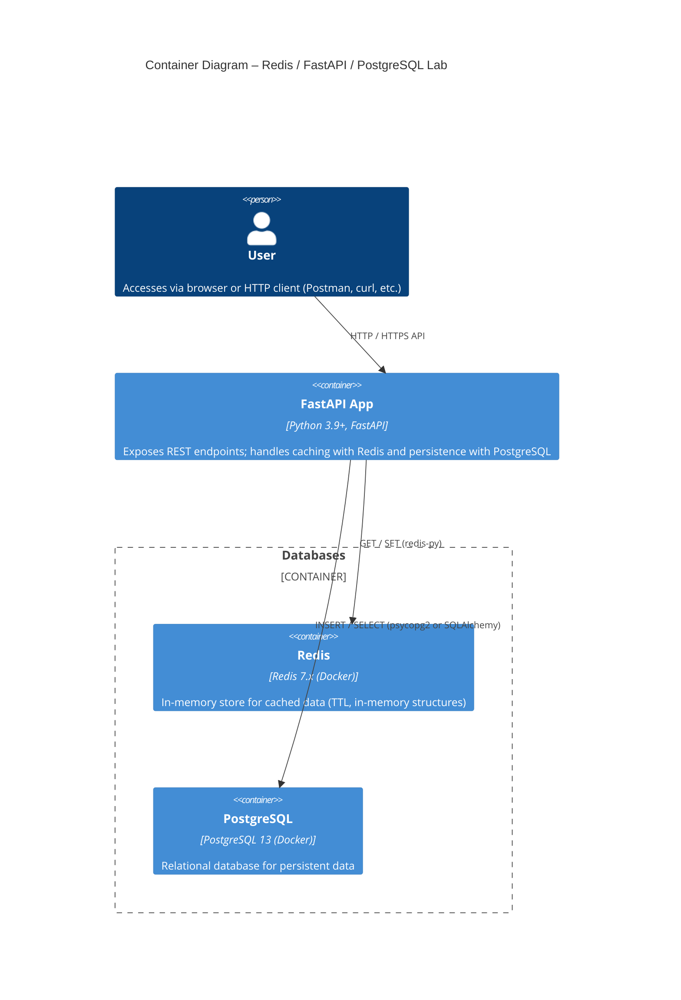
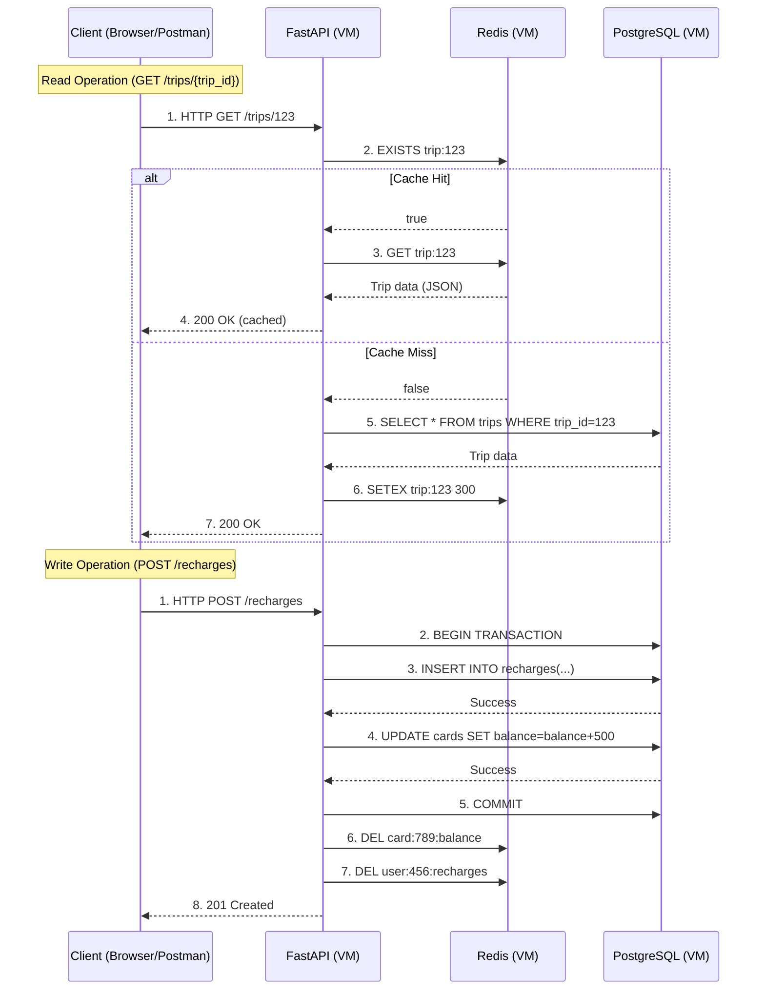

# Travel Recharge API – Distributed Systems Lab
This project simulates a recharge system (like TransMilenio cards) using a distributed architecture with FastAPI, PostgreSQL, and Redis. It demonstrates caching, database logic optimization, and API development using modern Python tools.

> **Goal**  
> Build, deploy and test a simple distributed architecture:
> - **FastAPI** REST API  
> - **PostgreSQL** relational database (Docker)  
> - **Redis** in-memory cache (Docker) 

---

## 📖 Table of Contents

1. [Context](#context)  
2. [Architecture Diagrams](#architecture)  
   - [Network Topology](#network-topology)  
   - [Container](#container)  
   - [Request flow](#request-flow)
3. [Prerequisites](#prerequisites)  
4. [Installation](#installation)   
5. [License](#license)  
6. [Pending Tasks](#pending-tasks)

---

## Context

Modern systems need low-latency, high-throughput data access.  
- **PostgreSQL** provides durability, consistency and complex queries.  
- **Redis** sits as a cache layer, speeding up repeated reads (e.g. stats, aggregates).  
- **FastAPI** ties it all together with async endpoints.

## Architecture
### Network Topology Diagram

### Container Diagram

---
### Request Flow Diagram

---
## Project Structure
```bash
SISTEMA-RECARGA-VIAJES-BACKEND/
├── app/
│   ├── database.py       # Database connection and setup
│   ├── dependencies.py   # Dependency injection for database sessions
│   ├── main.py           # FastAPI application and endpoints
│   ├── models.py         # Database models (if used)
│   └── __pycache__/      # Compiled Python files
├── requirements.txt      # Python dependencies
├── .gitignore            # Git ignore rules
├── DEPLOYMENT.md         # Deployment guide
└── README.md             # Project documentation
```

## Scripts for Latency Testing

### Cached Endpoints
Use the `latency_test.py` script to test the latency of cached endpoints. You can specify the number of iterations to simulate multiple requests.

#### Usage:
```bash
python scripts/latency_test.py
```

Follow the prompts to select an endpoint and specify the number of iterations.

### Non-Cached Endpoints
Use the `latency_non_cacheable.py` script to test the latency of non-cached endpoints. Similar to the cached script, you can specify the number of iterations.

#### Usage:
```bash
python scripts/latency_non_cacheable.py
```

Follow the prompts to select an endpoint and specify the number of iterations.

---

### Cached Endpoint Example: `/finance/revenue`
The `/finance/revenue` endpoint now uses Redis for caching. This significantly reduces latency for repeated requests. The cache is automatically invalidated after a specified TTL.

## Database Repository

The database for this project is managed in a separate repository. You can find it here:

[Database Repository](https://github.com/FreddyB200/travel-recharge-database.git)

---

## Getting Started

### Prerequisites
- VirtualBox VMs with Ubuntu/Alpine or any linux OS
- Docker & Docker Compose installed on each VM
- SSH keys configured for password-less login
- Git & GitHub account
- Python 3.8 or higher
- pip (Python package manager)

## Installation and How to Run Latency Tests (Step-by-Step Guide)

Follow these steps to replicate the latency reduction results using Redis as a cache.

### 1. Install Redis

#### Debian/Ubuntu:
```bash
sudo apt update
sudo apt install redis-server -y
sudo systemctl enable redis-server
sudo systemctl start redis-server
```

#### Alpine Linux:
```bash
apk update
apk add redis
rc-update add redis
rc-service redis start
```

Verify Redis is running:
```bash
redis-cli ping
# Should respond: PONG
```

### 2. Install Python dependencies
```bash
python3 -m venv venv
source venv/bin/activate
pip install -r requirements.txt
```

### 3. Configure environment variables
Copy `.env.postgres.example` and `.env.redis.example` to `.env` and adjust the values for your environment.

### 4. Start the API
- ### Development mode (auto-reload enabled)
 ```bash
fastapi dev app/main.py --host 0.0.0.0 --port 8000
```

- ### Production mode (no auto-reload)
```bash
fastapi run app/main.py --host 0.0.0.0 --port 8000
```
- ### Run with Uvicorn
```bash
uvicorn app.main:app --reload
```

### 5. Run latency tests

#### For cacheable endpoints:
```bash
python scripts/latency_test.py
```
Follow the prompts to select the endpoint and number of iterations.

#### For non-cacheable endpoints:
```bash
python scripts/latency_non_cacheable.py
```

### 6. Interpreting results
- **Cache MISS**: The first request is slower, as it queries PostgreSQL.
- **Cache HIT**: Subsequent requests are much faster, as data comes from Redis.

#### What data is cached and invalidation strategy
- **What is cached?**
  Responses from aggregate endpoints like `/trips/total` and `/finance/revenue` (aggregated, read-only data).
- **Invalidation strategy:**
  A TTL (Time To Live) is set in Redis. Cached data expires automatically after a defined period (e.g., 300 seconds), ensuring data freshness.


## See the API Documentation at

- http://127.0.0.1:8000/docs
- http://127.0.0.1:8000/redoc

---

## Latency Testing Results Examples

### Cacheable Endpoints

#### Endpoint: `/trips/total`
- **First Request (Cache MISS)**: 57.34 ms
- **Second Request (Cache HIT)**: 3.2 ms
- **Third Request**: 6.1 ms

#### Endpoint: `/trips/finance/revenue`
- **First Request (Cache MISS)**: 62.23 ms
- **Second Request (Cache HIT)**: 2.55 ms

### Non-Cacheable Endpoints

#### Endpoint: `/users/count`
- **Average Latency**: 8.11 ms

#### Endpoint: `/users/active/count`
- **Average Latency**: 9.11 ms

#### Endpoint: `/users/latest`
- **Average Latency**: 6.69 ms

---


---
#### With curl and Apache Benchmarking (ab):
Install curl if not available:
```bash
sudo apt update && sudo apt install curl -y
```

For Alpine Linux:
```bash
apk update && apk add curl apache2-utils
```

Test the endpoint with curl:
```bash
curl -X GET http://localhost:8000/finance/revenue
```

Test the endpoint with ab (Apache Benchmark):
```bash
ab -n 100 -c 10 http://localhost:8000/finance/revenue
```

#### Explanation of `ab` parameters:
- `-n 100`: Specifies the total number of requests to send to the server. In this case, 100 requests will be sent.
- `-c 10`: Specifies the number of concurrent requests to send at the same time. In this case, 10 requests will be sent simultaneously.

This command simulates a load test to measure the server's performance under concurrent requests.
---


---
## Technology Justification

- **FastAPI**: Chosen for its speed, async support, and automatic documentation, making it ideal for modern APIs and rapid prototyping.
- **PostgreSQL**: Provides transactional integrity, complex queries, and robust support for stored procedures.
- **Redis**: Enables caching of expensive queries, reducing latency and database load.
- **Docker**: Simplifies environment replication and deployment across different systems.

## Main Endpoints

| Endpoint                  | HTTP Method | Brief Description                                 | Example URL                              |
|---------------------------|-------------|---------------------------------------------------|------------------------------------------|
| `/trips/total`            | GET         | Returns the total number of registered trips.      | `http://localhost:8000/trips/total`      |
| `/finance/revenue`        | GET         | Returns the total revenue generated by recharges.  | `http://localhost:8000/finance/revenue`  |
| `/users/active/count`     | GET         | Counts the active users in the system.             | `http://localhost:8000/users/active/count`|


## Additional Deployment Notes

- Make sure your database is running and accessible with the credentials provided in the `.env` file.
- You can use the FastAPI interactive documentation at `http://127.0.0.1:8000/docs` to test the API endpoints.
- If you encounter issues, check the logs for detailed error messages.

## Alternative Ways to Run the Application

You can also run the application using the FastAPI CLI (if installed):

```bash
fastapi dev app/main.py --host 0.0.0.0 --port 8000
```

Or:

```bash
fastapi run app/main.py --host 0.0.0.0 --port 8000
```

The application will be available at `http://127.0.0.1:8000`.

## Running Redis with Docker (Alternative)

If you prefer to run Redis in a Docker container:

```bash
docker run -d --name redis -p 6379:6379 redis:latest
```

## Troubleshooting Common Issues

- **Connection refused**: Ensure the Redis server is running and the port is correct.
- **Timeout errors**: Check if the Redis server is under heavy load or if there are network issues.
- **Data not found**: Verify the cache keys and ensure they match between the application and Redis.
## Pending Tasks

Here are some ideas and tasks to expand and improve the project:

1. **New Repository: Spring Boot Version**
   - Create a new repository for the API implemented in Spring Boot.
   - Apply security with Spring Security and aim for a more robust codebase.

2. **Version in Go**
   - Develop a version of the API in Go to compare performance with Python.

3. **CI/CD Pipeline**
   - Implement continuous integration and deployment pipelines using GitHub Actions or similar tools.

4. **Dockerization**
   - Containerize the application using Docker for easier deployment and scalability.

5. **Database Backups**
   - Set up automated backups of the database to another server.
   - Decide whether to document this in the README of this repository or the API repository.

6. **Cloud Integration**
   - Integrate the application with cloud services like AWS, Google Cloud, or Azure.

7. **Automated Tests**
   - Write unit, integration, and end-to-end tests to ensure the reliability of the API.

8. **Logging**
   - Implement structured logging to monitor and debug the application effectively.

9. **Performance Testing**
   - Use tools like Locust to simulate user load and measure the performance of the API.

## Lessons Learned

- **Redis from scratch:**
  Learning Redis was a trial-and-error process, not just its syntax and commands, but understanding how it works internally (in-memory storage, TTL, persistence, etc.) and its real impact on API latency.
- **Integration and rationale for Redis:**
  Beyond technical integration, I realized Redis' value in offloading the database and improving user experience for repeated queries.
- **Stored procedures:**
  I decided to implement stored procedures in PostgreSQL (see the database repo) to optimize complex operations and reduce API-side logic.
- **Internal network between VMs:**
  Initially, I used NAT to connect the virtual machines, but found that an internal network was more efficient and secure for direct service communication, simplifying name resolution and avoiding port conflicts.
- **Additional challenges:**
  - Configuring Redis persistence and security.
  - Tuning TTL for a balance between data freshness and efficiency.
  - Documenting and automating tests so other developers can easily replicate results.

---   

## Acknowledgments
- [FastAPI Documentation](https://fastapi.tiangolo.com/)
- [SQLAlchemy Documentation](https://docs.sqlalchemy.org/)
- [Docker Documentation](https://docs.docker.com/)
- [Redis Documentation](https://redis.io/docs/latest/)

---

## License
This project is licensed under the MIT License. See the LICENSE file for details.