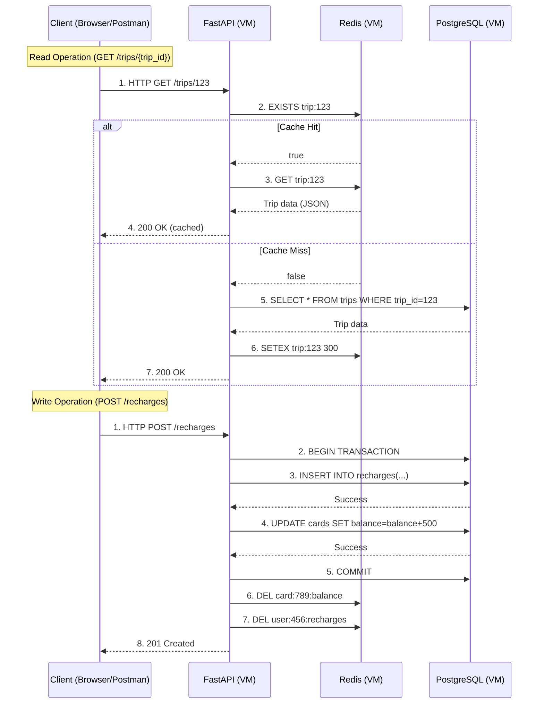

# Travel Recharge API – Distributed Systems Lab
This project simulates a recharge system (like TransMilenio cards) using a distributed architecture with FastAPI, PostgreSQL, and Redis. It demonstrates caching, database logic optimization, and API development using modern Python tools.

> **Goal**  
> Build, deploy and test a simple distributed architecture:
> - **FastAPI** REST API  
> - **PostgreSQL** relational database (Docker)  
> - **Redis** in-memory cache (Docker) 

---

## 📖 Table of Contents

1. [Context](#context)  
2. [Architecture Diagrams](#architecture)  
   - [Network Topology](#network-topology)  
   - [Container](#container)  
   - [Request flow](#request-flow)
3. [Prerequisites](#prerequisites)  
4. [Installation](#installation)   
5. [License](#license)  
6. [Pending Tasks](#pending-tasks)

---

## Context

Modern systems need low-latency, high-throughput data access.  
- **PostgreSQL** provides durability, consistency and complex queries.  
- **Redis** sits as a cache layer, speeding up repeated reads (e.g. stats, aggregates).  
- **FastAPI** ties it all together with async endpoints.

## Architecture
### Network Topology Diagram

### Container Diagram

---
### Request Flow Diagram

---
## Project Structure
```bash
SISTEMA-RECARGA-VIAJES-BACKEND/
├── app/
│   ├── database.py       # Database connection and setup
│   ├── dependencies.py   # Dependency injection for database sessions
│   ├── main.py           # FastAPI application and endpoints
│   ├── models.py         # Database models (if used)
│   └── __pycache__/      # Compiled Python files
├── requirements.txt      # Python dependencies
├── .gitignore            # Git ignore rules
├── DEPLOYMENT.md         # Deployment guide
└── README.md             # Project documentation
```

---

## Getting Started

### Prerequisites
- VirtualBox VMs with Ubuntu/Alpine or any linux OS
- Docker & Docker Compose installed on each VM
- SSH keys configured for password-less login
- Git & GitHub account
- Python 3.8 or higher
- pip (Python package manager)

### Installation

For installation guide, refer to the [Deployment Guide](DEPLOYMENT.md).

---

## See the API Documentation at

- http://127.0.0.1:8000/docs
- http://127.0.0.1:8000/redoc

---

## Database Repository

The database for this project is managed in a separate repository. You can find it here:

[Database Repository](https://github.com/FreddyB200/travel-recharge-database.git)

---
## Latency Testing Results

### Cacheable Endpoints

#### Endpoint: `/trips/total` MISS=postgres, HIT=redis
- **First Request (Cache MISS)**: 57.34 ms
- **Second Request (Cache HIT)**: 3.2 ms
- **Third Request**: 6 ms

#### Endpoint: `/trips/finance/revenue`
- **First Request (Cache MISS)**: 62.23 ms
- **Second Request (Cache HIT)**: 2.55 ms

### Non-Cacheable Endpoints

#### Endpoint: `/users/count`
- **Average Latency**: 8.11 ms

#### Endpoint: `/users/active/count`
- **Average Latency**: 9.11 ms

#### Endpoint: `/users/latest`
- **Average Latency**: 6.69 ms

---

## Scripts for Latency Testing

### Cached Endpoints
Use the `latency_test.py` script to test the latency of cached endpoints. You can specify the number of iterations to simulate multiple requests.

#### Usage:
```bash
python scripts/latency_test.py
```

Follow the prompts to select an endpoint and specify the number of iterations.

### Non-Cached Endpoints
Use the `latency_non_cacheable.py` script to test the latency of non-cached endpoints. Similar to the cached script, you can specify the number of iterations.

#### Usage:
```bash
python scripts/latency_non_cacheable.py
```

Follow the prompts to select an endpoint and specify the number of iterations.

---

### Cached Endpoint Example: `/finance/revenue`
The `/finance/revenue` endpoint now uses Redis for caching. This significantly reduces latency for repeated requests. The cache is automatically invalidated after a specified TTL.

#### Example:
Install curl if not available:
```bash
sudo apt update && sudo apt install curl -y
```

For Alpine Linux:
```bash
apk update && apk add curl apache2-utils
```

Test the endpoint with curl:
```bash
curl -X GET http://localhost:8000/finance/revenue
```

Test the endpoint with ab (Apache Benchmark):
```bash
ab -n 100 -c 10 http://localhost:8000/finance/revenue
```

#### Explanation of `ab` parameters:
- `-n 100`: Specifies the total number of requests to send to the server. In this case, 100 requests will be sent.
- `-c 10`: Specifies the number of concurrent requests to send at the same time. In this case, 10 requests will be sent simultaneously.

This command simulates a load test to measure the server's performance under concurrent requests.
---

## Pending Tasks

Here are some ideas and tasks to expand and improve the project:

1. **New Repository: Spring Boot Version**
   - Create a new repository for the API implemented in Spring Boot.
   - Apply security with Spring Security and aim for a more robust codebase.

2. **Version in Go**
   - Develop a version of the API in Go to compare performance with Python.

3. **CI/CD Pipeline**
   - Implement continuous integration and deployment pipelines using GitHub Actions or similar tools.

4. **Dockerization**
   - Containerize the application using Docker for easier deployment and scalability.

5. **Database Backups**
   - Set up automated backups of the database to another server.
   - Decide whether to document this in the README of this repository or the API repository.

6. **Cloud Integration**
   - Integrate the application with cloud services like AWS, Google Cloud, or Azure.

7. **Automated Tests**
   - Write unit, integration, and end-to-end tests to ensure the reliability of the API.

8. **Logging**
   - Implement structured logging to monitor and debug the application effectively.

9. **Performance Testing**
   - Use tools like Locust to simulate user load and measure the performance of the API.

---

## Acknowledgments
- [FastAPI Documentation](https://fastapi.tiangolo.com/)
- [SQLAlchemy Documentation](https://docs.sqlalchemy.org/)
- [Docker Documentation](https://docs.docker.com/)
- [Redis Documentation](https://redis.io/docs/latest/)

---
## License
This project is licensed under the MIT License. See the LICENSE file for details.

